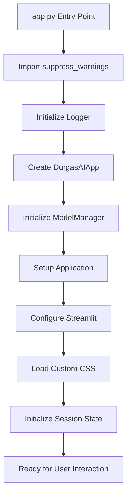
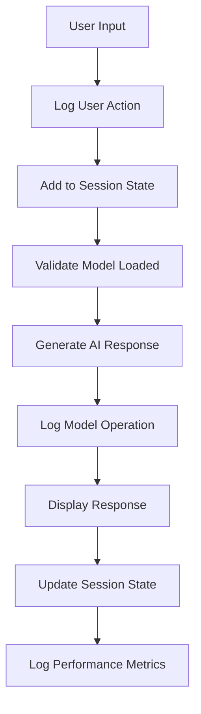
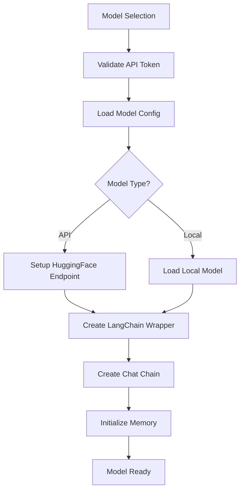

# 🏗️ DurgasAI Architecture Documentation

## Overview

DurgasAI is a comprehensive AI agent platform built with Streamlit, LangChain, and HuggingFace. This document provides a detailed overview of the system architecture, data flow, and debugging capabilities.

## 📊 System Architecture

### Core Components

```
DurgasAI/
├── app.py                     # Main Streamlit application entry point
├── page/                      # UI pages and components
│   ├── aiagent.py            # Main chat interface
│   ├── debug_dashboard.py    # Debug and monitoring dashboard
│   ├── component/            # Custom Streamlit components
│   ├── css/                  # Custom styling
│   └── js/                   # JavaScript enhancements
├── utils/                     # Core utilities and services
│   ├── config.py             # Configuration management
│   ├── model_manager.py      # AI model operations
│   ├── ui_helpers.py         # UI utilities and session management
│   ├── error_handler.py      # Error handling and recovery
│   ├── logger.py             # Comprehensive logging system
│   └── tool_manager.py       # Tool execution and management
├── output/                    # Runtime data and configurations
│   ├── config/               # Configuration files
│   ├── tools/                # Tool definitions and code
│   ├── workflows/            # Multi-step workflows
│   ├── logs/                 # Application logs
│   └── cache/                # Model and data cache
└── logs/                      # Main logging directory
    ├── debug/                # Debug logs by component
    ├── performance/          # Performance metrics
    └── sessions/             # Session-specific logs
```

## 🔄 Data Flow

### 1. Application Startup



### 2. User Interaction Flow



### 3. Model Management Flow



## 🐛 Debugging and Logging

### Logging System

The enhanced logging system provides multiple log levels and output streams:

#### Log Categories
- **Application Logs** (`logs/app.log`): Main application events
- **Debug Logs** (`logs/debug/debug.log`): Detailed debugging information
- **Model Logs** (`logs/debug/models.log`): AI model operations
- **Session Logs** (`logs/sessions/session_*.log`): Session-specific events
- **Performance Logs** (`logs/performance/performance.log`): Timing and metrics
- **Error Logs** (`logs/errors.log`): Error details and stack traces
- **Tool Logs** (`logs/debug/tools.log`): Tool execution details

#### Log Levels
- **DEBUG**: Detailed debugging information
- **INFO**: General information about application flow
- **WARNING**: Warning messages for non-critical issues
- **ERROR**: Error messages with context and recovery information
- **CRITICAL**: Critical errors that may cause application failure

### Session State Management

#### Session State Keys

| Key | Type | Description | Default |
|-----|------|-------------|---------|
| `messages` | List[Dict] | Conversation message history | `[]` |
| `model_loaded` | bool | Whether an AI model is loaded | `False` |
| `current_model` | str | Name of active model | `None` |
| `api_token` | str | HuggingFace API token | `""` |
| `system_prompt` | str | AI behavior prompt | Default assistant |
| `chat_session_id` | str | Session identifier | `"default"` |
| `total_messages` | int | Total messages in session | `0` |
| `session_start_time` | datetime | Session start time | Current time |
| `current_page` | str | Active page | `"home"` |
| `debug_mode` | bool | Debug mode toggle | `False` |
| `session_id` | str | Unique session identifier | Generated |

### Debug Dashboard

Access the debug dashboard via the "🔧 Debug" page to monitor:

#### System Information
- Python environment details
- System resource usage (CPU, memory, disk)
- Package versions and dependencies
- Platform and hardware information

#### Session State
- Current session state variables (sensitive data hidden)
- Session metrics and statistics
- Message history analysis
- Performance tracking

#### Logs
- Real-time log file status
- Recent log entries by category
- Error tracking and analysis
- Performance metrics visualization

#### Model Status
- Current model configuration
- Available models and their settings
- Model performance metrics
- Loading and response times

#### Tools & Configuration
- Available tools and their status
- Configuration file validation
- API key status (without revealing keys)
- Workflow definitions

## 🔧 Tool System

### Tool Architecture

Tools in DurgasAI are defined by:
1. **JSON Configuration** (`output/tools/*.json`): Metadata, parameters, security
2. **Python Implementation** (`output/tools/code/*.py`): Actual tool logic
3. **Tool Manager** (`utils/tool_manager.py`): Execution and monitoring

### Tool Execution Flow

1. **Discovery**: Tool manager scans for JSON configurations
2. **Validation**: Validates configuration and security settings
3. **Loading**: Imports Python code and registers functions
4. **Execution**: Runs tools with input validation and logging
5. **Monitoring**: Tracks performance and error rates

### Available Tools

| Category | Tools | Description |
|----------|-------|-------------|
| **Utility** | `add_two_numbers`, `subtract_two_numbers`, `calculate_math` | Basic mathematical operations |
| **Information** | `get_current_time`, `get_current_weather`, `search_web` | Information retrieval |
| **Analysis** | `data_analyzer_enhanced`, `number_list_analyzer`, `file_analyzer` | Data analysis and processing |
| **File Operations** | `file_operations`, `text_file_reader`, `text_list_processor` | File handling |
| **Web Research** | `browser_search`, `browser_open`, `google_agent_search` | Web browsing and research |
| **AI Generation** | `uso_image_generator`, `uso_style_transfer`, `outpaint_tool` | AI-powered content generation |

## 🚀 Performance Monitoring

### Metrics Tracked

- **Response Times**: AI model response generation timing
- **Tool Execution**: Individual tool performance metrics
- **Session Analytics**: User interaction patterns and statistics
- **System Resources**: CPU, memory, and disk usage monitoring
- **Error Rates**: Success/failure rates by component

### Performance Optimization

1. **Model Caching**: Streamlit caching for model loading
2. **Session State Management**: Efficient state updates and history limits
3. **Lazy Loading**: Components loaded on demand
4. **Error Recovery**: Graceful degradation and recovery options

## 🔒 Security and Validation

### Input Validation

- **API Tokens**: Format validation for HuggingFace tokens
- **User Input**: Length limits and content filtering
- **File Operations**: Path validation and security checks
- **Tool Parameters**: Type validation and range checking

### Security Levels

- **Low**: Basic validation, minimal restrictions
- **Medium**: Standard validation, moderate restrictions
- **High**: Comprehensive validation, strict restrictions

## 🛠️ Development and Debugging

### Adding Debug Logs

```python
from utils.logger import debug, info, warning, error, log_user_action

# Basic logging
debug("Detailed debugging information", "component_name")
info("General information", "component_name")
warning("Warning message", "component_name")
error("Error message", "component_name", exception_object)

# User action logging
log_user_action("action_name", {"key": "value"})

# Performance timing
with LoggedOperation("operation_name", "component"):
    # Your code here
    pass
```

### Adding New Tools

1. Create JSON configuration in `output/tools/`
2. Implement Python function in `output/tools/code/`
3. Follow the established parameter and return format
4. Include comprehensive error handling and logging

### Monitoring Performance

- Use the Debug Dashboard to monitor real-time metrics
- Check `logs/performance/performance.log` for detailed timing data
- Monitor `logs/debug/models.log` for AI model operations
- Review `logs/sessions/session_*.log` for user interaction patterns

## 📈 Analytics and Metrics

### User Analytics

- Page navigation patterns
- Model usage preferences
- Response time satisfaction
- Error occurrence rates
- Feature usage statistics

### System Analytics

- Model performance comparisons
- Resource usage trends
- Error pattern analysis
- Tool usage statistics
- Session duration and engagement

## 🔮 Future Enhancements

### Planned Features

1. **Advanced Analytics Dashboard**: Real-time charts and visualizations
2. **Model Performance Comparison**: Side-by-side model benchmarking
3. **Automated Error Recovery**: Self-healing capabilities
4. **Advanced Tool Chaining**: Complex multi-tool workflows
5. **Real-time Monitoring**: Live system health monitoring
6. **Export/Import Tools**: Configuration and session management
7. **Plugin System**: Third-party tool integration
8. **Multi-user Support**: User authentication and session isolation

### Technical Improvements

1. **Async Operations**: Non-blocking model operations
2. **Database Integration**: Persistent session storage
3. **Caching Optimization**: Advanced caching strategies
4. **Memory Management**: Improved memory usage optimization
5. **API Rate Limiting**: Intelligent request throttling
6. **Load Balancing**: Multiple model instance management

## 🤝 Contributing

When contributing to DurgasAI:

1. **Follow Logging Standards**: Use the established logging patterns
2. **Add Comprehensive Comments**: Explain complex logic and data structures
3. **Include Error Handling**: Implement proper error handling and recovery
4. **Write Tests**: Add tests for new functionality
5. **Update Documentation**: Keep this architecture document current

### Code Standards

- Use type hints for all function parameters and returns
- Include docstrings with detailed parameter and return descriptions
- Implement comprehensive error handling with logging
- Follow the established naming conventions
- Add performance monitoring for critical operations

---

This architecture document is maintained alongside the codebase and should be updated when significant changes are made to the system structure or functionality.
